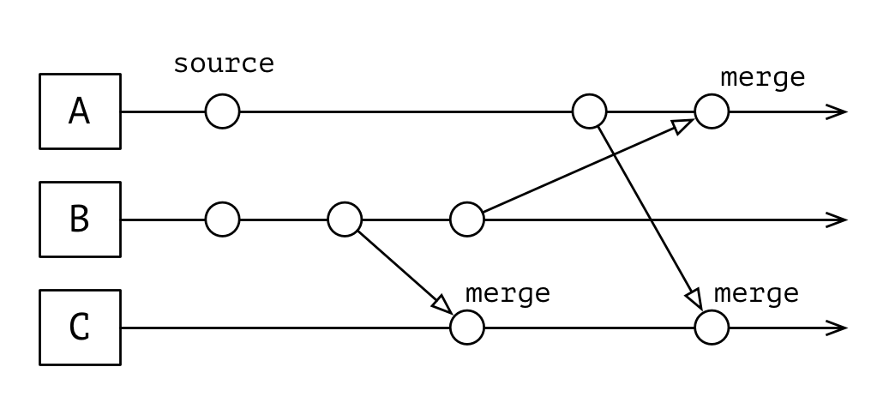

# CRDT

Comprehensive collection of data types for eventually consistent systems.

## Installation

In your `build.sbt` add

```scala
resolvers += "Machinomy" at "http://artifactory.machinomy.com/artifactory/release"

libraryDependencies += "com.machinomy" %% "crdt" % "0.0.2"
```

or if you like to be on a bleeding edge:

```scala
resolvers += "Machinomy" at "http://artifactory.machinomy.com/artifactory/snapshot"

libraryDependencies += "com.machinomy" %% "crdt" % "0.0.3-SNAPSHOT"
```

## Usage

Eventually consistent system comprises of machines, that work together. They have to maintain a shared global state.
CAP theorem [[GILBERT2002](#GILBERT2002)] limits properties of the state could be supported. Some applications permit to loosen Consistency
in favour of Availability and Partitioning. This leads to eventually consistent systems.

Conflict-free Replicated Data Type is a data structure designed to support eventual consistency [[SHAPIRO2011](#SHAPIRO2011)]. A machine that belongs to the system maintains a local replica of the global state.
Properties of CRDT guarantee the replicas converge to a common state. That makes the data structure
support simultaneous operations sustainable to network disturbancy.

CRDTs could be of two types:

- operation-based, or op-based for short,
- state-based.

The types can be emulated on top of each other. The difference is in payload the replicas send to each other.
As the name implies, it is an operation, like `add` or `remove`, or full state.

### State-based CRDT

State-based CRDT is a data structure that supports operation `combine`, or `join` for replicas so that:

* `a combine (b combine c) == (a combine b) combine c`,
* `a combine b == b combine a`,
* `a combine a == a`.

Data structure like this is a join-semilattice. We could derive a partial order on the replicas. We could say if `a ≤ b`. This effectively means state-based CRDTs converge to some value, the least upper bound. It gives another name then: Con<b>v</b>ergent Replicated Data Type, or C<b>v</b>RDT.



`combine` operation resolves any conflicts that happen between the replicas by following a formal rule. The rule differs among the types. A developer is responsible for choosing the right data structure for her need.

#### G-Counter

Short for grow-only counter. It could be incremented only. The combine takes the maximum count for each replica. Value is the sum of all replicas.

Say, replica id is `Int`, and GCounter manages `Int` replica counters as well:

```scala
import com.machinomy.crdt.state._
import cats.syntax.all._
import cats._

val counter = Monoid[GCounter[Int, Int]].empty // empty G-Counter
val firstReplica = counter + (1 -> 1) // increment replica 1
val secondReplica = counter + (2 -> 2) // increment replica 2
val firstReplicacombined = firstReplica |+| secondReplica // combine
val secondReplicacombined = secondReplica |+| firstReplica // combine

firstReplicacombined == secondReplicacombined // the result is independent of combine order
```

#### PN-Counter

A counter that could be increased, and decreased. Effectively consists of two G-Counters: for increases, and decreases. Value is a sum of all increases minus
all the decreases.

```
import com.machinomy.crdt.state._
import cats.syntax.all._
import cats._

val counter = Monoid[PNCounter[Int, Int]].empty // fresh PN-Counter
val firstReplica = counter + (1 -> 1) // increment replica 1
val secondReplica = counter + (2 -> -2) // decrement replica 2
val firstReplicacombined = firstReplica |+| secondReplica // combine
val secondReplicacombined = secondReplica |+| firstReplica // combine
firstReplicacombined == secondReplicacombined // the result is independent of combine order
firstReplicacombined.value == -1
```

#### G-Set

Short for grow-only set. Supports only addition of an element. `combine` operation is essentially a set union,
which is commutative and convergent.

```scala
import com.machinomy.crdt.state._
import cats.syntax.all._
import cats._

val counter = Monoid[GSet[Int]].empty // empty G-Set
val firstReplica = counter + 1 // add element
val secondReplica = counter + 2 // add element
val firstReplicacombined = firstReplica |+| secondReplica // combine
val secondReplicacombined = secondReplica |+| firstReplica // combine

firstReplicacombined == secondReplicacombined // the result is independent of combine order
```

#### GT-Set

Grow-only set that also tracks time of addition. `combine` operation is effectively a set union, that takes maximum of timestamps.

```scala
import com.github.nscala_time.time.Imports._
import cats._
import cats.syntax.all._
import com.machinomy.crdt.state._

val set1 = Monoid[GTSet[Int, DateTime]].empty + (1 -> DateTime.now) + (2 -> (DateTime.now + 3.seconds))
val set2 = Monoid[GTSet[Int, DateTime]].empty + (1 -> (DateTime.now + 1.seconds)) + (3 -> (DateTime.now + 3.seconds))
val left = set1 |+| set2
val right = set2 |+| set1

left == right
left.value == right.value
```

#### MC-Set

Max-Change Set assigns each element an integer. It tracks additions and deletions of the element. Odd means the element is present.
Even means absence of the element. Any update results in the number increment. Addition is allowed to only increment even numbers.
Removal is allowed to only increment odd numbers. That is, one can not add already present element, or remove the absent one.
When combining the element with maximum changes is preferred.

```scala
import com.machinomy.crdt.state._
import cats._
import cats.syntax.all._

val a = Monoid[MCSet[Int, Int]].empty + 1 + 2
val b = Monoid[MCSet[Int, Int]].empty + 1 + 3
val c = Monoid[MCSet[Int, Int]].empty + 2 + 3
val d = a - 2

(d |+| c).value == b.value
```

#### OR-Set

TODO

#### TP-Set

TODO

#### LWW-Element-Set

TODO

#### LWW-Register

TODO

### Operation-based CRDT

TODO

#### Counter

TODO

#### OR-Set

TODO

#### 2P2P-Graph

TODO

#### Add-only Monotonic DAG

TODO

#### Partial Order Graph

TODO

## To Do

TODO

## License

This code is open source software licensed under the [Mozilla Public License v2.0](http://mozilla.org/MPL/2.0).

## References

* <a name="GILBERT2002">[GILBERT2002]</a> [Brewer's conjecture and the feasibility of consistent, available, partition-tolerant web services](http://dl.acm.org/citation.cfm?id=564601)
* <a name="SHAPIRO2011">[SHAPIRO2011]</a> [A comprehensive study of Convergent and Commutative Replicated Data Types](https://hal.inria.fr/inria-00555588/en/)
